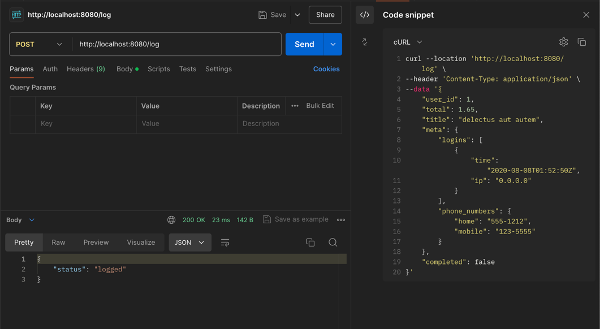
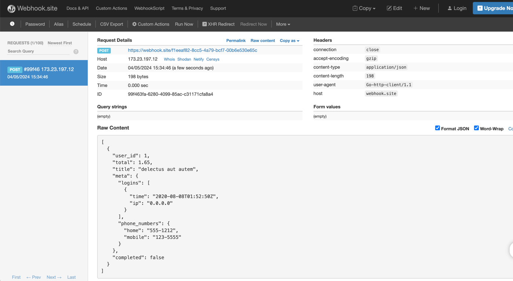
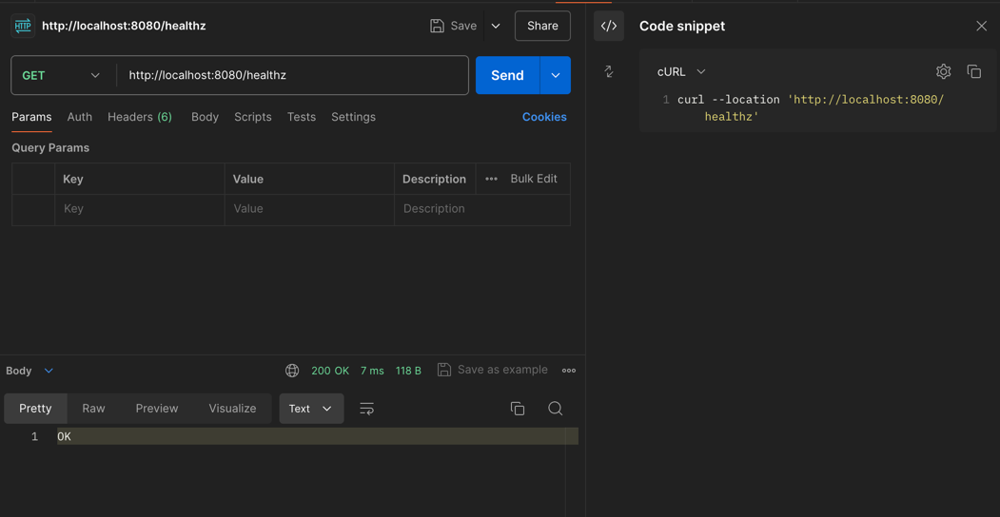

# Benzinga Webhook Receiver

## Overview
The Benzinga Webhook Receiver is a Go application designed to receive and process webhook requests. It features two primary endpoints:
- `/healthz` for health checks
- `/log` for logging JSON data received via POST requests.

## Getting Started

### Prerequisites
- Docker
- Go 1.17 (for local development and testing)
- Git (for version control)

### Installation

Clone the repository:

```bash
git clone https://github.com/lamthaithanhlong/benzinga-webhook-receiver.git
cd benzinga-webhook-receiver
```

### Building the Docker Image

Build the Docker image using the following command:

```bash
docker build -t webhook-receiver .
```

### Running the Application

Run the application using Docker:

```bash
docker run -p 8080:8080 webhook-receiver
```

This command starts the webhook receiver on port 8080.

## API Usage

### Health Check

To check the health of the application, use the following `curl` command:

```bash
curl --location 'http://localhost:8080/healthz'
```

### Posting Log Data

To post log data to the `/log` endpoint:

```bash
curl --location 'http://localhost:8080/log' \
--header 'Content-Type: application/json' \
--data '{
    "user_id": 1,
    "total": 1.65,
    "title": "delectus aut autem",
    "meta": {
        "logins": [
            {
                "time": "2020-08-08T01:52:50Z",
                "ip": "0.0.0.0"
            }
        ],
        "phone_numbers": {
            "home": "555-1212",
            "mobile": "123-5555"
        }
    },
    "completed": false
}'
```

### Testing with RequestBin

You can test webhook integrations using the provided RequestBin URL:

```url
https://webhook.site/f1eeaf82-8cc5-4a79-bcf7-00b6e530e65c
```

Send data to this endpoint to see how the application processes and forwards requests.

## Running Tests

### Linting with Golangci-lint

Run Golangci-lint to ensure the codebase adheres to linting standards:

```bash
golangci-lint run
```

### Running Ginkgo Tests

Execute the following command to run tests recursively with verbose output:

```bash
ginkgo -r -v
```

### Function Flow diagram


### Activity Diagram


### Sequence Diagram


### Result Log





### Result healthz



## Contributing

Contributions to the Benzinga Webhook Receiver are welcome! Please refer to the contributing guidelines before making pull requests.

## License

This project is licensed under the [MIT License](LICENSE.md).
